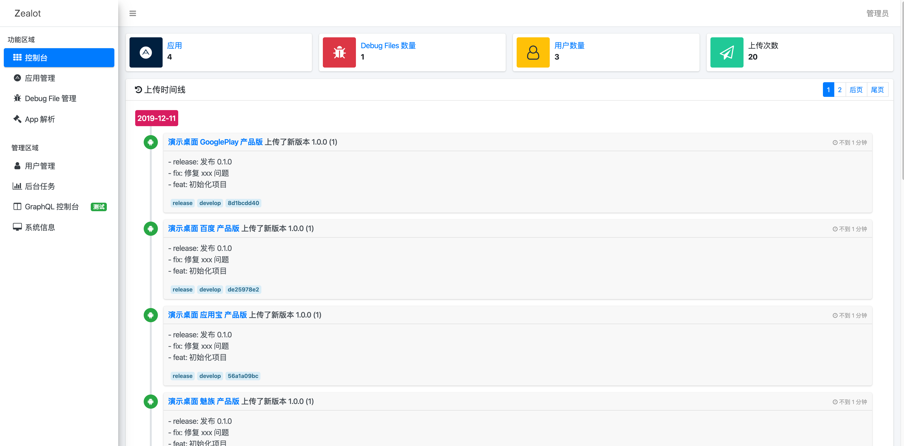

# Zealot

<a class="github-button" href="https://github.com/getzealot/zealot" data-icon="octicon-star" data-size="large" data-show-count="true" aria-label="Star getzealot/zealot on GitHub">Star</a>
<a class="github-button" href="https://github.com/getzealot/zealot/subscription" data-icon="octicon-eye" data-size="large" data-show-count="true" aria-label="Watch getzealot/zealot on GitHub">Watch</a>
<a class="github-button" href="https://github.com/getzealot/zealot/fork" data-icon="octicon-repo-forked" data-size="large" data-show-count="true" aria-label="Fork getzealot/zealot on GitHub">Fork</a>
<a class="github-button" href="https://github.com/iocyleaf" data-size="large" data-show-count="true" aria-label="Follow @icyleaf on GitHub">Follow @icyleaf</a>

移动应用上传没有如此简单、解放开发打包的烦恼，轻松放权给测试、产品、运营等使用 App 的人员，深度与 Jenkins 和 Gitlab 集成。

## 特性

- [x] 支持 iOS 和 Android 应用的上传和下载
- [x] 支持应用创建各种类型（Debug、AdHoc、Release）和渠道（小米、华为、Oppp、Vivo、应用宝等）
- [x] 支持 iOS dSYM 和 Android Progruard 文件的备份管理和解析
- [x] 支持单次上传解析 iOS 和 Android 包信息
- [x] 支持自定义网络（WebHooks）数据来实时发送给通知服务（钉钉、企业微信、Slack 等）
- [x] 可接入 Jenkins 服务实现远程构建
- [x] 可接入 Gitlab 服务直接挂钩源码管理
- [x] 支持丰富的 REST APIs
- [x] 支持 OAuth 认证登录（目前以接入 Google，后续会加入 LDAP）
- [ ] 支持 GraphGL 接口（进行中）
- [ ] 提供 fastlane 插件提供上传服务（旧插件需要移植即可）
- [ ] 提供 cli 命令行工具（旧插件需要移植即可但貌似没有啥必要，有用没用先列在这）